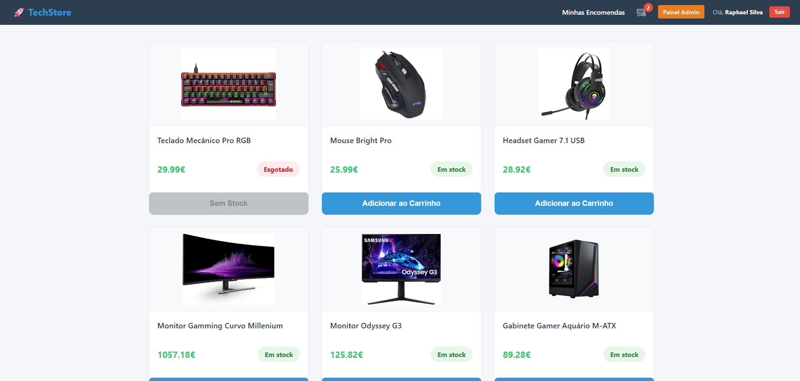
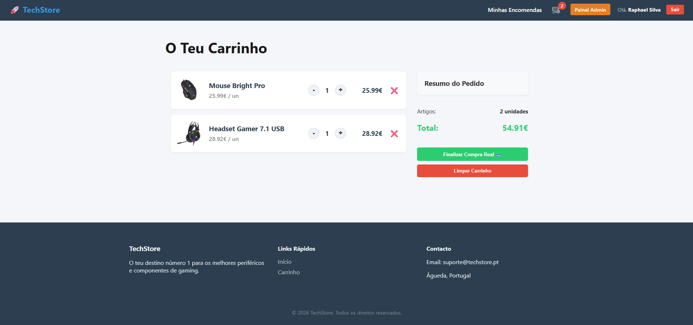
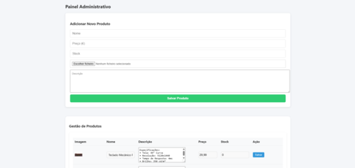
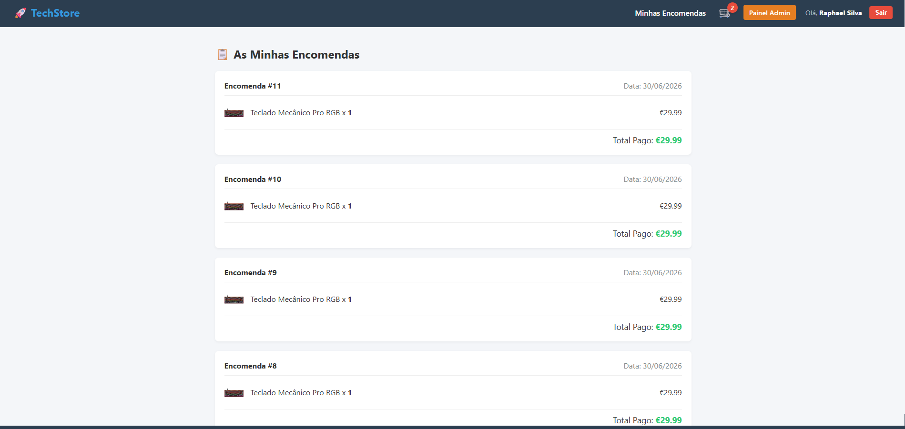

# TechStore - E-commerce de Periféricos

Projeto de e-commerce Full Stack desenvolvido como parte do meu portfólio para demonstrar habilidades em desenvolvimento web, desde a estrutura do banco de dados até a interface do usuário.

## 🚀 Sobre o Projeto

A **TechStore** é uma plataforma dedicada à venda de periféricos e componentes de gaming. O sistema foi projetado para oferecer uma experiência de compra intuitiva para o cliente final e uma gestão eficiente para o administrador.

## 🛠 Tecnologias Utilizadas

Este projeto foi construído com as seguintes tecnologias:

* **Frontend:** [React](https://react.dev/) para criação de uma interface dinâmica, modular e responsiva.
* **Backend:** [Node.js](https://nodejs.org/) para o processamento de lógica de servidor e gerenciamento de API.
* **Banco de Dados:** [MySQL](https://www.mysql.com/) para o armazenamento e gestão relacional de dados (usuários, produtos e pedidos).

## ⚙️ Funcionalidades Principais

### Usuário
* **Catálogo de Produtos:** Visualização de itens com indicação de disponibilidade (Em stock / Esgotado).
* **Carrinho de Compras:** Adição/remoção de produtos, atualização de quantidades e fechamento de pedidos.
* **Histórico de Encomendas:** Consulta detalhada das compras realizadas pelo usuário.
* **Autenticação:** Criação de conta e login seguro.

### Administrador
* **Painel de Gestão:** Interface para cadastrar novos produtos, editar itens existentes e gerenciar o estoque.
* **Histórico Global:** Acesso completo ao histórico de vendas de todos os usuários da plataforma.

## 📸 Demonstração do Sistema

| Tela Inicial | Carrinho |
| :---: | :---: |
|  |  |

| Gestão Admin | Histórico de Compras |
| :---: | :---: |
|  |  |

## 💡 Aprendizados
Este projeto permitiu consolidar conhecimentos essenciais como:
* Estruturação de banco de dados relacional.
* Criação de rotas protegidas para controle de permissões (User vs Admin).
* Integração entre uma API Node.js e uma interface React.

---
Desenvolvido por **Raphael Silva** | [LinkedIn](https://www.linkedin.com/)
